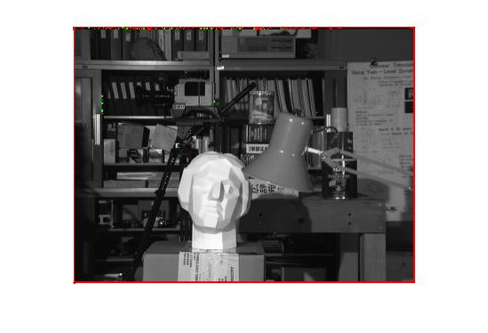
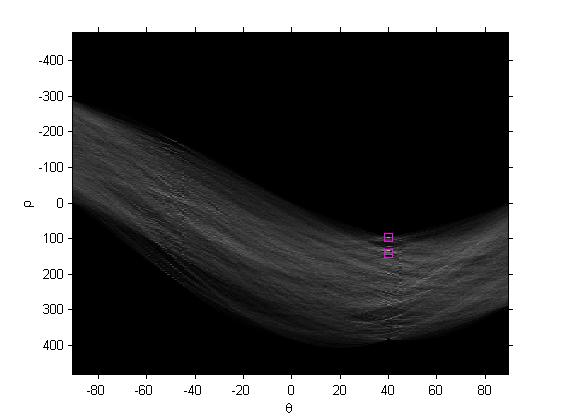

# Image-Processing
Image Processing commonly used for pretreatment :Matlab code

run li8_12.m get the following result:

run li8_13.m get the following result:

run li8_14.m get the following result:

run li8_15.m get the following result:

显示Hough变换后平面的峰值为：
   623   131
   577   131

